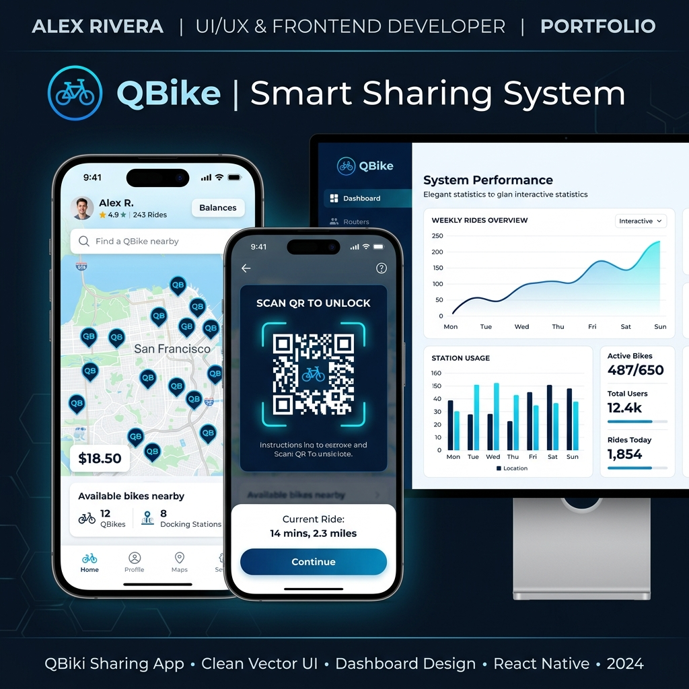
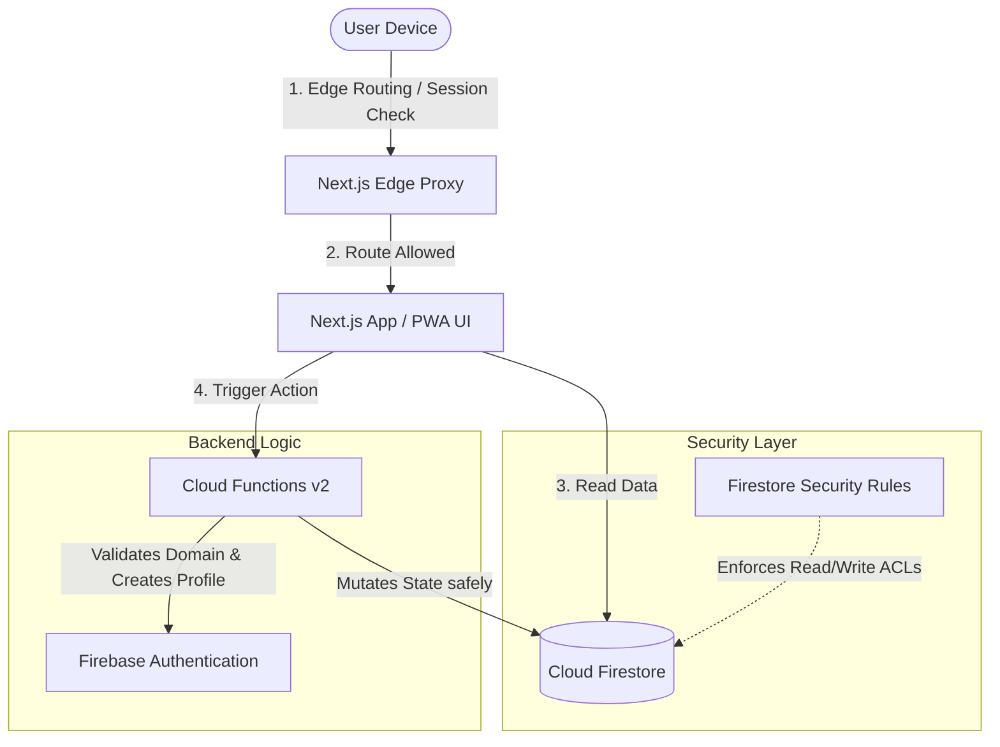

# QBike — Smart Bicycle Reservation System

<div align="center">
  
</div>

A full-stack, progressive web application (PWA) designed to manage bicycle reservations, inventory tracking, and user verification for **KMJ (Kolej Matrikulasi Johor)**, supporting 3,000+ active users. 

---

## 🏗️ System Architecture

QBike is engineered with a decoupled, serverless frontend-backend architecture. Next.js 16 acts as the user interface layer and edge router, communicating with Firebase Services (Firestore, Storage, Authentication) and Cloud Functions v2.



---

## 🛠️ Tech Stack & Patterns

*   **Frontend**: Next.js 16 (App Router, Strict TypeScript), React 19, Tailwind CSS v4, shadcn/ui
*   **Backend & Serverless**: Firebase Functions v2 (Node 22), Firestore (Standard Mode), Cloud Tasks (Scheduled Workflows)
*   **Core Libraries**: `qr-scanner` (optimized camera QR scanning), `recharts` (analytics dashboard), `react-hook-form` + `zod` (runtime validation)
*   **PWA Enabler**: `@ducanh2912/next-pwa` (offline caching, app shell manifest, install banners)

---

## ⚡ Engineering Achievements

### 1. Atomic Booking Mutations (Cloud Functions Transaction)
To prevent race conditions, double-booking, and negative inventory, QBike uses atomic Firestore transactions inside Cloud Functions. Below is the conceptual transaction logic used when a student creates an on-demand booking:

```typescript
import { onCall, HttpsError } from "firebase-functions/v2/https";
import { getFirestore } from "firebase-admin/firestore";

export const createOnDemandBooking = onCall(async (request) => {
  const db = getFirestore();
  const { userId, userFullName, userMatrixNo } = request.data;

  return db.runTransaction(async (transaction) => {
    // 1. Fetch current inventory singleton
    const inventoryRef = db.doc("inventory/current");
    const inventorySnap = await transaction.get(inventoryRef);
    const inventory = inventorySnap.data();

    if (!inventory || inventory.available <= 0) {
      throw new HttpsError("failed-precondition", "No bikes currently available.");
    }

    // 2. Decrement available inventory, increment booked counts
    transaction.update(inventoryRef, {
      available: inventory.available - 1,
      bookedInAdvance: (inventory.bookedInAdvance || 0) + 1,
    });

    // 3. Create a unique booking record
    const bookingRef = db.collection("bookings").doc();
    transaction.set(bookingRef, {
      bookingId: bookingRef.id,
      userId,
      userFullName, // Denormalized for rapid dashboard rendering
      userMatrixNo,
      status: "pending",
      createdAt: new Date(),
    });

    return { bookingId: bookingRef.id };
  });
});
```

### 2. Edge-Level Authorization Routing
Instead of relying on slow client-side loading checks, QBike validates user sessions and routes at the edge using Next.js 16 `proxy.ts`. Prefetches are bypassed automatically to keep Firebase session verification reads minimal.

```typescript
import { NextResponse } from 'next/server';
import type { NextRequest } from 'next/server';
import { getAuth } from 'firebase-admin/auth';

export async function proxy(request: NextRequest) {
  const { pathname } = request.nextUrl;
  const cookieStore = request.cookies;

  // Skip prefetch requests to avoid read spikes on Google Cloud Auth limits
  const isPrefetch = request.headers.get('purpose') === 'prefetch';
  if (isPrefetch) return NextResponse.next();

  const sessionToken = cookieStore.get('__session')?.value;
  if (!sessionToken && !pathname.startsWith('/auth')) {
    return NextResponse.redirect(new URL('/auth', request.url));
  }

  // Verify custom session claims and handle role enforcement
  return NextResponse.next();
}
```

### 3. Declarative Firestore Security Rules
All database read/write access is protected at the database engine level. Clients can only perform reads, and mutations are rejected unless triggered by authorized server contexts.

```javascript
rules_version = '2';
service cloud.firestore {
  match /databases/{database}/documents {
    function isAuthenticated() { return request.auth != null; }
    function isAdmin() { 
      return isAuthenticated() && 
             get(/databases/$(database)/documents/users/$(request.auth.uid)).data.role == "admin"; 
    }

    match /users/{userId} {
      allow read: if request.auth.uid == userId || isAdmin();
      allow write: if false; // All modifications go through Cloud Functions
    }

    match /bookings/{bookingId} {
      allow read: if resource.data.userId == request.auth.uid || isAdmin();
      allow write: if false; // Cloud Functions transact booking states safely
    }
  }
}
```

---

## 📊 Firestore Database Schema Design

QBike utilizes a mix of normalized structures and intentional denormalization (such as embedding `userFullName` and `userMatrixNo` inside each booking) to reduce read costs and maximize read speeds.

*   `/users/{userId}`: User profile records, role metadata, and verification statuses.
*   `/bikes/{bikeId}`: Hardware status (`available`, `in_use`, `maintenance`), total trips, and current booking reference.
*   `/bookings/{bookingId}`: Atomic booking records referencing the student ID and the assigned bicycle.
*   `/inventory/current`: Singleton keeping real-time counters of general fleet counts.
*   `/policy/current`: Singleton defining global operations criteria (e.g. grace periods, cooldowns, operating hours).
*   `/reports/{reportId}`: Unified feedback, damage, collection, and policy violation logs.
